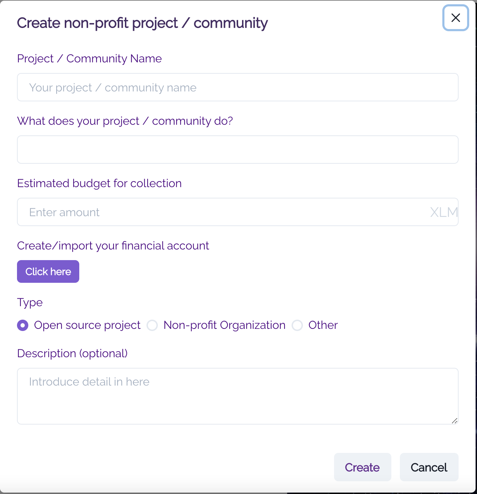
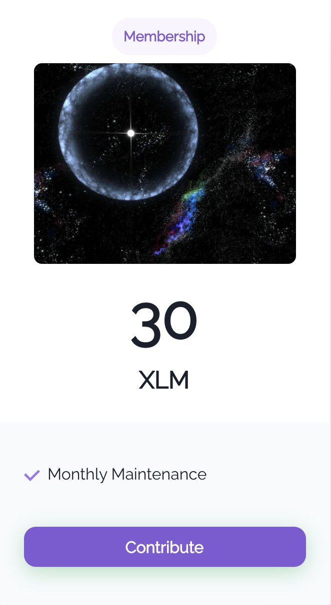
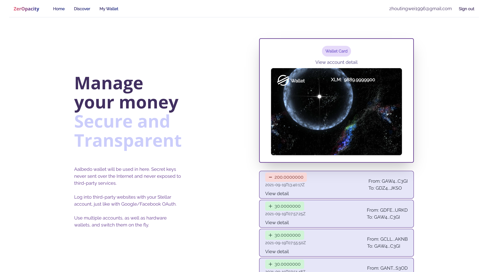
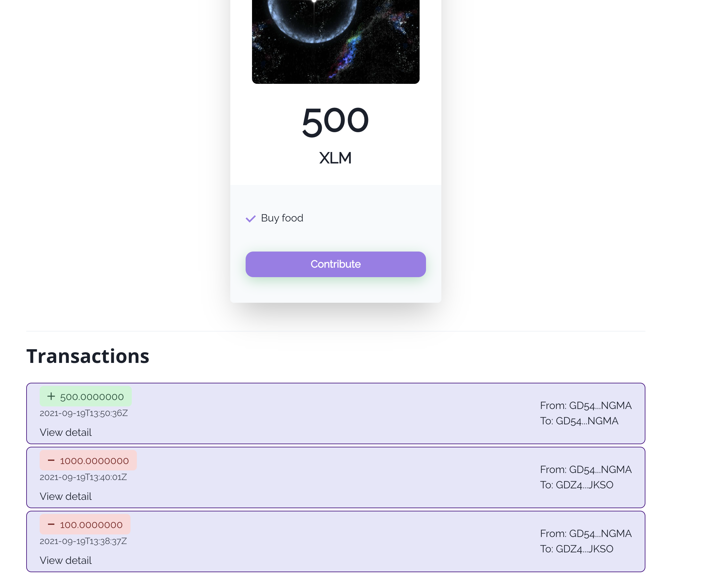

# ZerOpacity
Currently there are many fundraising scenarios in society. A brilliant world-changing idea needs funding to become landed, a child needs support for medical treatment when his/her family is in trouble, and an environment-saving organization needs money for advertisements and human-resources. While during this process, corruption and faulty bookkeeping could happen at any position, harming investors and contributors’ enthusiasm.

ZerOpacity is a platform providing transparent and trustful fundraising services for non-profit organizations and activities. Other than many centralized payment systems, our payment is based on the Stellar Network, which uses blockchain technologies and creates a decentralized and open transaction network. Everyone can publish their fundraising activities on our platform or contribute to activities they are interested in. We want to make sure that every single bucket is traceable on our platform and every payment is used in the way it is supposed to be.

## How to use ZerOpacity

### Website
https://zeropacity.firebaseapp.com/

### Publish an event for fundraising
As the activity or event launcher, you can create your project after login to our website. Basic information includes project_name, description, estimated budget, etc.

### Contribute to an project
If you are interested in any project, you can make a payment to the project. Our webpage will redirect you to Albedo wallet, and make the payment by XLM through Stellar Network.

# View Wallet
You can view your account wallet on the website.

### Review payment records
If you want to figure out the detailed payment and budget usage of an project, you can click on the 'details' button and our webpage will redirect you to the Stellar Network viewpoint which contains all the income and outcome payment records related to the current project.

## How we built it

### Albedo Wallet
We use Albedo API to create and login in users' stellar account without memorizing tedious private key. In addition, the APIs of sending and receiving payments were also ne used.

### Stellar Platform
We use Stellar API to retrieve the balence and transaction of users' stellar account. 

### Web Frontend
Next.js is an open-source React front-end development web framework that enables functionality such as server-side rendering and generating static websites for React-based web applications. We launched our project on the next.js framework and use continuous integration and continuous delivery on Google Firebase platform Hosting service.

### Web Backend
We use serverless deployment on the Google Firebase platform, and make use of the Firebase Functions to support our service. Its automatic scalability improves the reliability of our website. We also use Firestore as our NoSQL database to support our service.

## Challenges we ran into
We spent quite a bit of time getting familiar with the Stellar Network and its Horizon API. At the beginning, we want to create a wallet service of our own. After talking with the Stellar Network developer at the Pinnacle court, he told us there is already a wallet application called Albedo and we can reuse it for our development. This suggestion saved us lots of time and we can concentrate more on our webpage development.

## Accomplishments
We created a fundraising platform for non-profit organizations and activities, which is quite different from traditional fundraising platforms such as 'Go Fund Me'. We do not rely on traditional centralized payment methods such as check or credit card, but utilize the blockchain to record every payment and make it transparent to the public.
The ZerOpacity platform prevents the corruption and abuse of donation, making the nonprofit stay at non-profit.

## What's next for ZerOpacity
Apply more features to the payment options, e.g. monthly donation.

## Built With
[Firebase](https://firebase.google.com/), [Next.js](https://nextjs.org/), [React](https://reactjs.org/), [Stellar Network]('https://stellar.org/learn/intro-to-stellar') and [Albedo Wallet](https://albedo.link/playground).